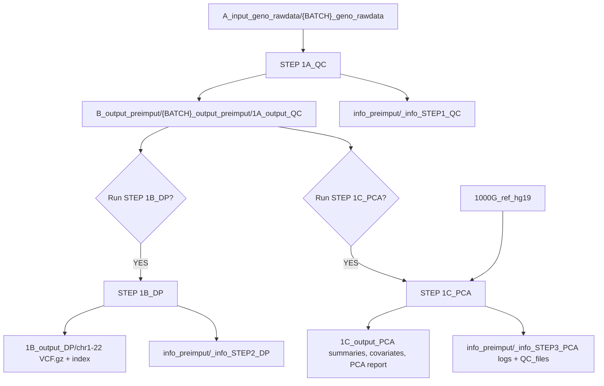

# STEP1_PREIMPUT

`STEP1_PREIMPUT` is a batch-oriented pre-imputation workflow for GWAS genotype data. It starts from raw PLINK target data, performs target-level QC, and can optionally generate imputation-ready chromosome VCFs and run PCA against a 1000 Genomes reference panel.

The workflow is split into three steps:

```text
STEP 1A_QC  -> Target genotype quality control
STEP 1B_DP  -> Pre-imputation data processing and VCF generation
STEP 1C_PCA -> Target + 1000G PCA and ancestry reporting
```

The top-level scripts are coordinators. The actual implementation is inside `main_scripts/`.

## Repository Layout

```text
STEP1_PREIMPUT/
|-- README.md
|-- USER_GUIDE.md
|-- STEP1_PREIMPUT_QC_DP.sh
|-- STEP1_PREIMPUT_QC_DP_JOB.sh
|-- submit_STEP1_PREIMPUT.sbatch
|-- main_scripts/
|   |-- 00_config_helpers.sh
|   |-- 01_step1A_QC.sh
|   |-- 02_step1B_DP.sh
|   `-- 03_step1C_PCA.sh
|-- scripts_1A_QC/
|-- scripts_1B_DP/
|-- scripts_1C_PCA/
|-- 1000G_ref_hg19/
|-- A_input_geno_rawdata/
|-- B_output_preimput/
`-- info_preimput/
```

`A_input_geno_rawdata/`, `1000G_ref_hg19/`, and the `scripts_1*` folders are user-provided or repository-provided inputs. `B_output_preimput/` and `info_preimput/` are generated by the pipeline.

## Entry Points

```text
STEP1_PREIMPUT_QC_DP.sh
```

Interactive coordinator. It detects available batches, asks which batches to process, and asks whether to run `STEP 1B_DP` and `STEP 1C_PCA`.

```text
STEP1_PREIMPUT_QC_DP_JOB.sh
```

Non-interactive coordinator used by SLURM. It reads:

```bash
BATCH_MODE=ALL|SELECTED
BATCH_LIST="batch1 batch2"
RUN_STEP1B_DP=YES|NO
RUN_STEP1C_PCA=YES|NO
```

```text
submit_STEP1_PREIMPUT.sbatch
```

SLURM launcher template. Edit its exported variables before submission.

## Configuration

Shared parameters, modules, paths, and helper functions live in:

```text
main_scripts/00_config_helpers.sh
```

Important defaults:

```bash
PCA_REF_DIR="1000G_ref_hg19"
QC_SCRIPT_DIR="scripts_1A_QC"
DP_SCRIPT_DIR="scripts_1B_DP"
PCA_SCRIPT_DIR="scripts_1C_PCA"

mymissigness1=0.2
mymissigness2=0.02
mymaf=0.01
myhwe1=1e-6
myhwe2=1e-10
myrelatedness=0.125
mysplitx_build="b37"
```

Pre-imputation MAF filtering uses `mymaf=0.01` by default.

## Batch Detection

Batches are detected from directories matching:

```text
A_input_geno_rawdata/{BATCH_NAME}_geno_rawdata/
```

The genotype prefix inside each batch directory must be:

```text
{BATCH_NAME}_geno_rawdata
```

Accepted input formats:

```text
{BATCH_NAME}_geno_rawdata.bed/.bim/.fam
{BATCH_NAME}_geno_rawdata.ped/.map
```

## Optional Batch Files

Optional sex update file:

```text
A_input_geno_rawdata/{BATCH_NAME}_geno_rawdata/{BATCH_NAME}_pheno_sex.txt
```

PLINK `--update-sex` format:

```text
FID IID SEX
```

where `SEX` is `1` for male and `2` for female.

Optional IID keep list:

```text
A_input_geno_rawdata/{BATCH_NAME}_geno_rawdata/{BATCH_NAME}_IIDs.txt
```

One IID per line. If present, only these IIDs are kept before QC. If absent, the whole batch is processed.

## 1000G PCA Reference

`STEP 1C_PCA` expects the reference files in:

```text
1000G_ref_hg19/
```

Preferred reference dataset:

```text
1000G_ref_hg19/1000G_QC_PRC_v4.bed
1000G_ref_hg19/1000G_QC_PRC_v4.bim
1000G_ref_hg19/1000G_QC_PRC_v4.fam
```

Alternative accepted prefix:

```text
1000G_ref_hg19/QCreferencedata.bed
1000G_ref_hg19/QCreferencedata.bim
1000G_ref_hg19/QCreferencedata.fam
```

Population metadata file:

```text
1000G_ref_hg19/integrated_call_samples_v3.20200731.ALL.ped
```

or:

```text
1000G_ref_hg19/PEDreferencedata_1000G.ped
```

The PCA R script accepts metadata columns named either `SampleID` or `Individual.ID`, and `Population` or `POPULATION`.

## Internal Workflow



## STEP 1A_QC

`main_scripts/01_step1A_QC.sh` creates a cleaned target PLINK dataset.

Main operations:

1. Converts/copies raw PLINK input to a working binary dataset.
2. Optionally keeps only IIDs listed in `{BATCH_NAME}_IIDs.txt`.
3. Keeps only A/C/G/T SNPs.
4. Optionally updates phenotype if `step0fam=YES`.
5. Filters missingness:
   - SNP missingness with `--geno mymissigness1`
   - individual missingness with `--mind mymissigness1`
   - SNP missingness with `--geno mymissigness2`
   - individual missingness with `--mind mymissigness2`
6. Runs sex discrepancy checks, using temporary `--split-x b37` if PAR/XY is not already coded.
7. Restricts to autosomes before MAF/HWE.
8. Filters MAF using `--maf mymaf`.
9. Filters HWE using `myhwe1` and `myhwe2`.
10. Computes heterozygosity on pruned SNPs and removes heterozygosity outliers.
11. Computes relatedness. Related individuals are reported but not removed from the final pre-imputation QC dataset.

Final dataset:

```text
B_output_preimput/{BATCH}_output_preimput/1A_output_QC/{BATCH}_preimput_QC.bed
B_output_preimput/{BATCH}_output_preimput/1A_output_QC/{BATCH}_preimput_QC.bim
B_output_preimput/{BATCH}_output_preimput/1A_output_QC/{BATCH}_preimput_QC.fam
```

Key QC info:

```text
info_preimput/{BATCH}_info_preimput/_info_STEP1_QC/{BATCH}_STEP1_QC_summary.txt
info_preimput/{BATCH}_info_preimput/_info_STEP1_QC/{BATCH}_excluded_individuals_TOTAL.txt
info_preimput/{BATCH}_info_preimput/_info_STEP1_QC/{BATCH}_excluded_snps_TOTAL.txt
info_preimput/{BATCH}_info_preimput/_info_STEP1_QC/6B_pihat_min{myrelatedness}.genome
info_preimput/{BATCH}_info_preimput/_info_STEP1_QC/6B_related_individuals_not_removed.txt
```

## STEP 1B_DP

`main_scripts/02_step1B_DP.sh` starts from the final `STEP 1A_QC` PLINK dataset and prepares VCFs for imputation.

Main operations:

1. Copies the QC dataset into `_work_STEP2_DP`.
2. Removes palindromic SNPs.
3. Assigns missing variant IDs.
4. Removes duplicated rsIDs.
5. Removes duplicated positions/alleles using `PRE0D_Duplicates.R`.
6. Renames variants as `CHR:BP`.
7. Removes duplicated `CHR:BP` IDs after renaming.
8. Optionally runs LiftOver if enabled.
9. Computes frequencies.
10. Downloads and runs `HRC-1000G-check-bim.pl`.
11. Runs the generated `Run-plink.sh`.
12. Compresses and indexes chromosome VCFs with `bcftools`.

Final VCF outputs:

```text
B_output_preimput/{BATCH}_output_preimput/1B_output_DP/QCtargetdata-updated-chr1.vcf.gz
B_output_preimput/{BATCH}_output_preimput/1B_output_DP/QCtargetdata-updated-chr1.vcf.gz.tbi
...
B_output_preimput/{BATCH}_output_preimput/1B_output_DP/QCtargetdata-updated-chr22.vcf.gz
B_output_preimput/{BATCH}_output_preimput/1B_output_DP/QCtargetdata-updated-chr22.vcf.gz.tbi
```

The downloaded HRC helper files, logs, QC reports, and `Run-plink.sh` are moved into:

```text
info_preimput/{BATCH}_info_preimput/_info_STEP2_DP/
```

Large temporary files generated during HRC checking and VCF creation are removed from the working directory after successful completion.

## STEP 1C_PCA

`main_scripts/03_step1C_PCA.sh` starts from the final `STEP 1A_QC` PLINK dataset and runs joint target + 1000G PCA.

Main operations:

1. Copies target QC and 1000G reference into `_work_STEP3_PCA`.
2. Removes palindromic SNPs from the target.
3. Assigns missing variant IDs.
4. Removes duplicated IDs and duplicated positions.
5. Renames variants as `CHR:BP`.
6. Harmonizes alleles against the reference.
7. Excludes unresolved discordant variants.
8. Merges target + 1000G.
9. Prunes merged data and runs PCA.
10. Runs the integrated `PRE3_PCA.R` ancestry report.
11. Runs target-only PCA to generate covariates.

The integrated report compares:

```text
EUR +/- 3SD
Nearest 1000G superpopulation centroid
EUR PC1-PC2 3-sigma ellipse
EUR Mahalanobis distance
Strict nonEUR consensus across methods
```

Main outputs:

```text
B_output_preimput/{BATCH}_output_preimput/1C_output_PCA/{BATCH}_STEP3_PCA_summary.txt
B_output_preimput/{BATCH}_output_preimput/1C_output_PCA/{BATCH}_PCA_results.covariate
B_output_preimput/{BATCH}_output_preimput/1C_output_PCA/{BATCH}_PCA_3_target_ancestry_ALL_METHODS_details.txt
B_output_preimput/{BATCH}_output_preimput/1C_output_PCA/{BATCH}_PCA_3_ancestry_method_summary.txt
B_output_preimput/{BATCH}_output_preimput/1C_output_PCA/PCA_results/3_PCA_INTEGRATED_ANCESTRY_REPORT.pdf
```

Technical PCA logs and intermediate QC files:

```text
info_preimput/{BATCH}_info_preimput/_info_STEP3_PCA/logs/
info_preimput/{BATCH}_info_preimput/_info_STEP3_PCA/QC_files/
```

## Generated Output Layout

For each batch:

```text
B_output_preimput/{BATCH}_output_preimput/
|-- 1A_output_QC/
|-- 1B_output_DP/
|-- 1C_output_PCA/
|-- _work_STEP2_DP/
`-- _work_STEP3_PCA/

info_preimput/{BATCH}_info_preimput/
|-- _info_STEP1_QC/
|-- _info_STEP2_DP/
|-- _info_STEP3_PCA/
`-- {BATCH}_preimput_combined_summary.txt
```

Working directories are temporary and should be removed automatically after their step completes.

## Dependencies

The pipeline is designed for an HPC environment with environment modules:

```bash
module load PLINK/1.9b_6.21-x86_64
module load R/4.3.2-gfbf-2023a
module load BioPerl/1.7.8-GCCcore-12.3.0
module load BCFtools/1.21-GCC-12.3.0
```

The exact module names may depend on the cluster. If modules are hidden until a module path is loaded, load the relevant module paths before running the pipeline.

## Troubleshooting Notes

Convert Windows line endings before running on Linux:

```bash
sed -i 's/\r$//' STEP1_PREIMPUT_QC_DP.sh STEP1_PREIMPUT_QC_DP_JOB.sh submit_STEP1_PREIMPUT.sbatch main_scripts/*.sh scripts_1C_PCA/*.R
```

Check shell syntax:

```bash
bash -n STEP1_PREIMPUT_QC_DP.sh
bash -n STEP1_PREIMPUT_QC_DP_JOB.sh
bash -n main_scripts/00_config_helpers.sh
bash -n main_scripts/01_step1A_QC.sh
bash -n main_scripts/02_step1B_DP.sh
bash -n main_scripts/03_step1C_PCA.sh
```

Check R syntax:

```bash
Rscript -e "parse('scripts_1C_PCA/PRE3_PCA.R')"
```

If `bcftools` or `Rscript` are not found, check module loading with:

```bash
which plink
which bcftools
which Rscript
```

